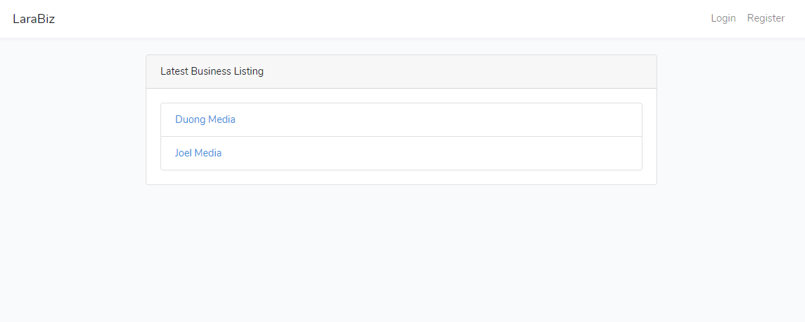
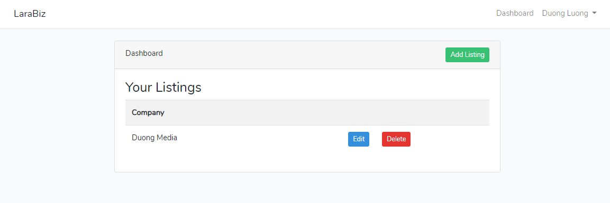

# Business Listing-Laravel-project

## Table of Contents

* [Description](#Description)
* [Dependencies](#dependencies)

## Description

This project is Business Listing Website which I used PHP and Laravel to create. The application allow users login or register to create a business list and save it into a database.

## Achievements
* User registration
* User login and dashboard
* Adding user id to listings
* Access control

The following photos is the Home page and Dashboard page:

## Dependencies

The project is cooperated with a PHP framework is Laravel, a JavaScript framework is Bootstrap and MySQL Database.
